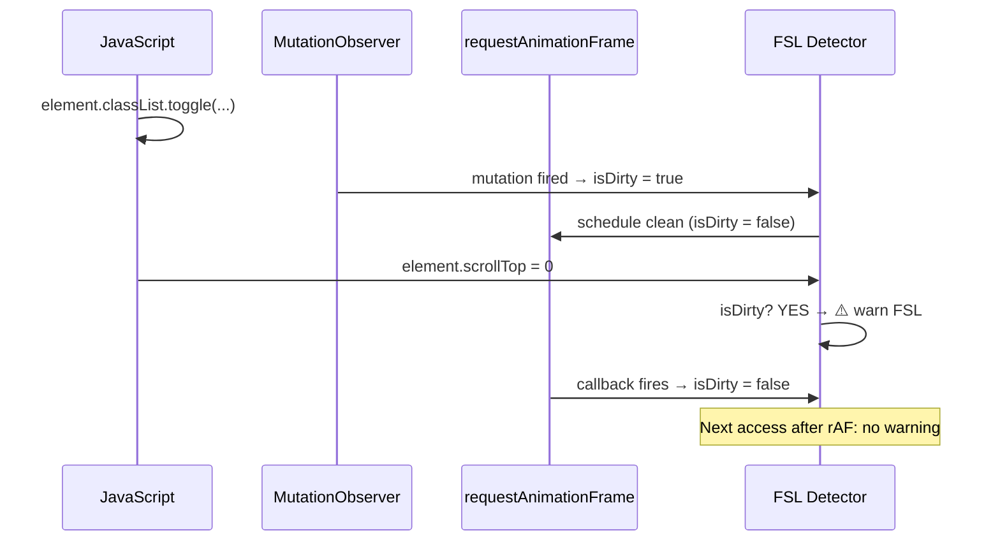

import snippet from '../../snippets/Interaction/Forced-Synchronous-Layout.js?raw'
import { Snippet } from '../../components/Snippet'

# Forced Synchronous Layout Detector

### Overview

Detects the **Forced Synchronous Layout (FSL)** pattern at runtime — when JavaScript reads geometric properties from the DOM immediately after mutating styles, forcing the browser to perform layout synchronously on the main thread.

**Why this matters:**

Normally the browser batches style recalculations and layout at the end of each frame. FSL breaks this contract: reading a geometric property after a style mutation forces the browser to flush pending style changes and recalculate layout _right now_, before the current task finishes. This blocks the main thread and contributes directly to long tasks, poor INP, and jank.

**A typical FSL pattern:**

```js
container.classList.toggle('state-a'); // invalidates styles
container.scrollTop = 0;              // forces layout synchronously → FSL
```

**The fix — double rAF:**

```js
container.classList.toggle('state-a');
requestAnimationFrame(() => {         // 1st rAF: browser processes styles
  requestAnimationFrame(() => {       // 2nd rAF: layout tree is clean
    container.scrollTop = 0;          // no FSL
  });
});
```

**What this snippet intercepts:**

Mutation sources — detected synchronously:

| API | Coverage |
|-----|----------|
| `classList.add/remove/toggle/replace` | `DOMTokenList.prototype` |
| `element.setAttribute('class'/'style', ...)` | `Element.prototype` |
| `element.style.setProperty(...)` | `CSSStyleDeclaration.prototype` |
| `element.style.cssText = ...` | `CSSStyleDeclaration.prototype` |

Geometric reads/writes — triggers the FSL warning:

| Property / Method | Type | Prototype |
|-------------------|------|-----------|
| `scrollTop`, `scrollLeft` | read + write | `Element.prototype` |
| `scrollWidth`, `scrollHeight` | read | `Element.prototype` |
| `clientTop`, `clientLeft`, `clientWidth`, `clientHeight` | read | `Element.prototype` |
| `offsetTop`, `offsetLeft`, `offsetWidth`, `offsetHeight` | read | `HTMLElement.prototype` |
| `getBoundingClientRect()` | read | `Element.prototype` |

### Snippet

<Snippet code={snippet} />

### Understanding the Output

When an FSL is detected, the console shows:

```
⚠️ [FSL Detector] Forced Synchronous Layout detected!
   Property  : scrollTop (write)
   Element   : div#scroll-container.scroll-container
   Since last mutation: 0.3 ms
   Stack trace:
     at set scrollTop (snippet)
     at reproduceIssue (main.js:62)
     at HTMLButtonElement.<anonymous> (main.js:94)
```

| Field | Description |
|-------|-------------|
| **Property** | The geometric property accessed and whether it was a read or write |
| **Element** | `tagName#id.classes` of the element involved |
| **Since last mutation** | Milliseconds between the style/class mutation and the forced layout |
| **Stack trace** | Full call stack to locate the offending code |

With the double-`requestAnimationFrame` fix applied, no warnings appear — the dirty flag is cleared before the geometric access.

### How It Works



### Limitations

- Detects FSL only for the intercepted geometric properties. `getComputedStyle()` and `window.getComputedStyle()` also trigger layout but are not covered.
- Direct property assignments on `element.style` (e.g. `element.style.display = 'none'`) are not intercepted — only `setProperty`, `cssText`, `setAttribute`, and `classList` methods are. Adding individual CSS property descriptors would be impractical.
- Intercepts mutations on any element in the document, not scoped to `document.body`. Mutations on `<head>` elements (e.g. dynamic `<style>` injection) would also set the dirty flag.
- The overhead of intercepting prototype methods on every mutation and layout read can slow down pages with very frequent DOM changes. Use only during development and debugging.
- `stopFSLDetector()` restores all intercepted prototypes to their original descriptors.

### Use Case: Angular CDK Virtual Scroll

The classic FSL scenario in Angular applications using `CdkScrollable`: a route change triggers a CSS class toggle on the scroll container, followed by an immediate `scrollTop = 0` reset before the browser has processed the new styles.

```js
// Problematic pattern (triggers FSL)
container.classList.toggle('state-a');
container.scrollTop = 0;              // forces layout before browser flushes styles

// Fixed pattern (double rAF)
container.classList.toggle('state-a');
requestAnimationFrame(() => {
  requestAnimationFrame(() => {
    container.scrollTop = 0;
  });
});
```

A reproducible demo is available at [github.com/nucliweb/forced-synchronous-layout](https://github.com/nucliweb/forced-synchronous-layout).

### Further Reading

- [Forced Synchronous Layout](https://joanleon.dev/en/forced-synchronous-layout/) | Joan Leon
- [Avoid large, complex layouts and layout thrashing](https://web.dev/articles/avoid-large-complex-layouts-and-layout-thrashing) | web.dev
- [What forces layout / reflow](https://gist.github.com/paulirish/5d52fb081b3570c81e3a) | Paul Irish
- [Rendering performance](https://developer.chrome.com/docs/devtools/performance) | Chrome DevTools
- [Long Animation Frames API](https://developer.mozilla.org/en-US/docs/Web/API/PerformanceLongAnimationFrameTiming) | MDN
