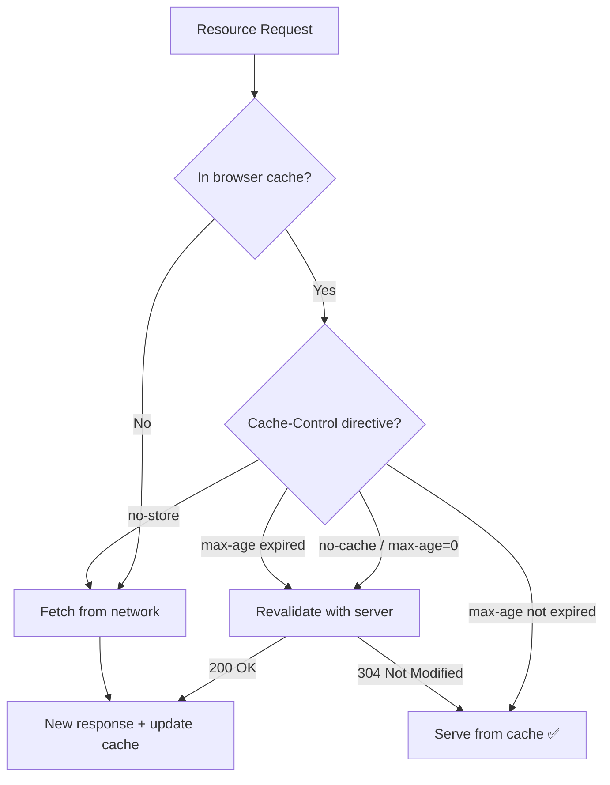

import snippet from "../../snippets/Loading/Cache-Strategy-Analysis.js?raw";
import { Snippet } from "../../components/Snippet";

# Cache Strategy Analysis

Audits HTTP caching strategies across all page resources, identifying resources without cache, short-lived cache configurations, cache anti-patterns, and CDN cache hit rates. Provides a cache efficiency score and actionable recommendations.

**What this snippet analyzes:**

- Cache strategy classification for every resource (immutable, long, medium, short, no-cache, no-store, etc.)
- Resources missing cache headers entirely
- Static assets with insufficient cache duration
- Cache anti-patterns (versioned files without `immutable`, large uncached resources, outdated `Expires` usage)
- CDN cache hit/miss detection (Cloudflare, Vercel, CloudFront, and generic proxies)
- Cache efficiency score and estimated bandwidth savings
- Protocol distribution (HTTP/1.1 vs H2/H3)
- Uncompressed text resources and duplicate resource loads

**How the browser decides to serve a resource:**



**Why caching matters for performance:**

| Metric        | Impact                                                     |
| ------------- | ---------------------------------------------------------- |
| LCP           | Cached resources load instantly — no network round-trip    |
| TTFB          | CDN cache hits dramatically reduce server response time    |
| Bandwidth     | Cached resources don't consume data (mobile users benefit) |
| Repeat visits | Good caching makes subsequent page loads near-instant      |

### Snippet

<Snippet code={snippet} />

## Understanding the Results

### Cache Strategy Distribution

Every resource is classified into one of these strategies:

| Strategy            | Cache-Control directive                   | Typical use case                              |
| ------------------- | ----------------------------------------- | --------------------------------------------- |
| `immutable`         | `max-age=31536000, immutable`             | Versioned/hashed static assets                |
| `long`              | `max-age > 86400` (> 1 day)               | Static assets with long lifetime              |
| `medium`            | `max-age 3600–86400` (1h–1d)              | Semi-static content                           |
| `short`             | `max-age < 3600` (< 1h)                   | Frequently updated content                    |
| `swr`               | `stale-while-revalidate`                  | Content served stale while background refresh |
| `must-revalidate`   | `must-revalidate` + ETag/Last-Modified    | Documents that must be fresh                  |
| `no-cache`          | `no-cache` or `max-age=0`                 | Forces revalidation every request             |
| `no-store`          | `no-store`                                | Never cached (sensitive data)                 |
| `expires-only`      | Only `Expires` header, no `Cache-Control` | Legacy servers (outdated)                     |
| `none`              | No caching headers at all                 | Missing cache configuration                   |
| `unknown (CORS)`    | Cross-origin, headers not readable        | Add `Timing-Allow-Origin` for visibility      |
| `cached (inferred)` | `transferSize=0` but no readable headers  | Browser cached, strategy unknown              |

The **Cache Efficiency Score** shows what percentage of resources have an effective cache strategy (`immutable`, `long`, `medium`, `swr`, or `must-revalidate`).

### Resources Without Cache

Resources with strategy `none`, `no-store`, or `no-cache`. For static assets (JS, CSS, fonts, images), this is a performance problem — every page load re-fetches them from the network.

**Fix:** Add `Cache-Control: max-age=31536000, immutable` for versioned assets, or at minimum `max-age=86400` for stable static files.

### Short Cache Resources

Resources with `max-age < 3600` (less than 1 hour). Pay attention to:

- **Has Hash = ✅**: If the URL contains a content hash, the file changes when its content changes. A short cache is wasted opportunity — use `immutable`.
- **Has Hash = ❌**: The URL is stable, so a short cache forces frequent re-fetches. Increase the TTL if the content changes infrequently.

### Cache Anti-patterns

| Pattern                   | Severity   | Meaning                                                                          |
| ------------------------- | ---------- | -------------------------------------------------------------------------------- |
| `static-no-store`         | 🔴 Error   | A JS, CSS, font, or image file has `no-store` — these should always be cacheable |
| `large-no-cache`          | 🔴 Error   | A resource > 100 KB has no cache — significant bandwidth waste per visit         |
| `versioned-short-cache`   | 🟡 Warning | A hashed URL has `max-age < 86400` — safe to use much longer TTL                 |
| `expires-without-cc`      | 🟡 Warning | Uses only `Expires` header — outdated, less reliable than `Cache-Control`        |
| `maxage-zero-static`      | 🟡 Warning | Static asset with `max-age=0` — browser revalidates on every request             |
| `short-cache-static`      | 🟡 Warning | Static asset with `max-age < 3600` — increase TTL for better performance         |
| `versioned-not-immutable` | 🔵 Info    | Hashed URL without `immutable` — adding it avoids conditional GET requests       |

### CDN Cache Status

Reads CDN-specific response headers to determine cache hit/miss per resource:

| Header            | CDN detected                                     |
| ----------------- | ------------------------------------------------ |
| `CF-Cache-Status` | Cloudflare                                       |
| `X-Vercel-Cache`  | Vercel Edge Network                              |
| `X-Cache`         | CloudFront or generic CDN                        |
| `Age`             | Generic proxy/CDN (presence = served from cache) |
| `Via`             | Any HTTP proxy                                   |
| `Server-Timing`   | CDN that exposes cache info in Server-Timing     |

A **CDN hit rate below 70%** usually indicates the CDN cache is cold, the TTL is too short, or cache-busting headers (`Cache-Control: no-store`, `Vary: *`) are preventing caching at the edge.

## Header Analysis Scope and CORS Limitations

Header inspection (`Cache-Control`, `Expires`, CDN headers) requires issuing `HEAD` requests via `fetch()`. Two categories of resources are excluded from this analysis and fall back to **Tier 1 heuristics** (Performance API data only):

### Cross-origin resources

Resources served from a different origin (different scheme, host, or port) than the current page are blocked by CORS unless the server sends `Access-Control-Allow-Origin`. This includes subdomains — `api.web.dev` is cross-origin from `www.web.dev`.

Those resources appear as **"CORS-restricted"** in the output.

### Non-static resource types

`fetch`, `xhr`, `iframe`, `beacon`, and similar dynamic resource types are excluded intentionally:

- Their servers commonly reject `HEAD` requests with `4xx`/`5xx` errors
- Dynamic endpoints (API calls, tracking pixels) have different caching semantics than static assets
- They produce console noise if fetched (e.g., CSRF token endpoints, analytics beacons)

These resources are still visible in the summary via Tier 1 data:

- `transferSize === 0` and `encodedBodySize > 0` → served from browser cache
- `transferSize > 0` → fetched from the network

To get header visibility on your own cross-origin or CDN resources, configure the server to send:

```http
Access-Control-Allow-Origin: *
Timing-Allow-Origin: *
```

## Further Reading

- [HTTP caching](https://web.dev/articles/http-cache) | web.dev
- [Prevent unnecessary network requests with the HTTP Cache](https://developer.chrome.com/docs/lighthouse/performance/uses-long-cache-ttl) | Chrome Developers
- [Cache-Control](https://developer.mozilla.org/en-US/docs/Web/HTTP/Headers/Cache-Control) | MDN
- [Stale-while-revalidate](https://web.dev/articles/stale-while-revalidate) | web.dev
- [Content delivery networks (CDNs)](https://web.dev/articles/content-delivery-networks) | web.dev
- [Service Worker Analysis](/Loading/Service-Worker-Analysis) | Complements cache analysis for SW-managed caches
- [TTFB](/Loading/TTFB) | CDN cache hits directly reduce TTFB
